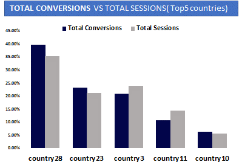

# Website-Analysis-Report-with-Microsoft-Excel
>*An online-vacation website report*

## Introduction:

Here is a website analysis report of a company that sells holidays (vacations) online through a website seeking answers and insights on the overall performances of the company website over time.

## Problem Statement:

The CEO and the web development team of a company that sells holidays (vacations) online through a website would like to know how their company website has performed over the months (Jan — Oct) in the year 2017 and would like to get answers and insights on the following areas;

* What is the Average time spent on the website?
* How often do users turn customers?
* Do we have any bounces and why?
* Over the months, how well do the website get new visits, pageviews and customers?
* Do users interact with the website enough (like how often) or bounced without spending time on the website, why?
* How engaging are our web contents
* Where do most of our customers come from and how well do they interact with the website?

## Data Sourcing:

Data was provided in the raw form and can be found [here](https://docs.google.com/spreadsheets/d/18V4qrI6ZnJNO8EwOocSTWmuHiQQocB80/edit#gid=707954281)

## Data transformation / Cleaning:

* The data was loaded into excel from Home/Data/From file/From text/csv/Open/Transform data then loaded to power query where all transformation and cleaning was done.

>*Before / After transformation and cleaning*

|     Before      |     After      |
|:----------------|:--------------:|
   |

* The data consist of 8 Columns (landing page, month of year, sessions, new users, bounces, pageviews, avg session duration, transactions) and 909+ rows.
Empty rows, errors and duplicated rows were removed.

* Landing page column was splitted into 6 different columns (Web contents, Country, Search volume, Region, Web version and resorts) and some pivoting, unpivoting and data type changes were done to some columns.

* Month of year was splitted to Months & Year and month column was changed from 1–10 to Jan-Oct with a dax code( Date.MonthName([Month of Year.2]*29, “mmm”).

* At this point the data is set for findings and visualization so i close and load in power query which return us back to our excel sheet.

## Findings:

>*What is the Average time spent on the website?*

According to Google, A good benchmark for Average Time on a Page is 52 seconds, across multiple industries. That said, over 2 minutes is pretty impressive and anything between 1–2 minutes is on par for niche sites.

What this mean is, from the analysis conducted it shows that the average time spent on the company website is very impressive at 04:45 mins.

However, does the time spent determines the rate at which users turn customers? Let us have a look at the average conversion rate as well.

>*How often do users turn customers?*

According to Google, the average landing page conversion rate across industries was 2.35%, yet the top 25% are converting at 5.31% or higher. Ideally, you want to break into the top 10% — these are the landing pages with conversion rates of 11.45% or high

At 18.18% is the rate at which users became customers on the company website which puts the company website at google top 10% spot.

If 18.18% converted to customers, what is the percentage of those that left the website without buying from the company?

>*Do the website have any bounces and why?*

Yes, there is a bounce rate of 0.29% of users that left the company website without further actions or did not buy from the company.

According to google, A very low Bounce Rate such as 5% or lower is an indication that there is probably something wrong with your website. Anytime a Bounce Rate seems suspiciously low (lower than 10%), that should raise a red flag for you. If you see a bounce rate of 2% for example, don’t start celebrating.

This suspiciously low bounce rate could be as a result of poor tracking, poor migration, and some other events might be fired together with a pageview.

Lets take a look at visits and pageviews over the months.

>*How well do the website get new visits, pageviews and customers over the months?*

The metrics of the website shows that overall visits and views is less than 30% which is below average, it could be as a result of bad-user experience, strange URLs, broken link, outdated information, no mobile optimization, no search engine optimization etc.

Analysis shows that visits, views and conversion rate in Jan was around 15% and a rapid decrease occurred from Feb till June before a skyrocket percentage in July and a drastic fall from Aug to October.

What is the cause of this? lets look at how users left, interacted with the website and the average time spent.

>*How how often do users interact or bounce on the website and the average time spent?*

A normal web tracking on bounces is from 10–20% and above but not more than 45%.

Over 15% of users left the website in Jan and July. Meanwhile, July had the highest Interactions and higher percentage of time spent at 20.8% sessions and 02:00 mins avg time spent.

What could be the cause? what content is driving this traffic?

>*How engaging are the web contents (Top5)?*

Good website content is optimized and attractive to search engines and humans. It holds valued keywords that your audience look out for, interact with and possibly convert them to customers.

Apparently, Global Content had 68.85% sessions and 63.64% conversions which means that 68.85% of users were engaged with the Global Content of which 63.64% of the users bought from the company.

However, Info Content had 19.91% & 14.16% sessions and conversions respectively while Product Content had 8.99% & 10.81% sessions and conversions respectively while others are below 10%.

Where do most of these customers come from?

>*Where do most of the customers come from and how well do they interact with the website (Top5)?*

Analysis shows that, over 39.62% of the users turned customers came from Country28 with 35% total sessions while 23% and 20% of users turned customers were from Country23 and Country3 respectively with 20% and 23% total sessions and the rest are below 15% conversions and total sessions.

It appears country3 and country11 sessions were higher than conversions which could be as a result of bad trust signals, addressing wrong traffic, use of irrelevant keywords and complex checkouts etc.

Lets have a look at the dashboard, conclusions and recommended solutions.

## Dashboard

## Conclusions:

>*Overall Findings shows that;*

* Avg. time spent and Avg. conversions are quite impressive at 04:45 mins and 18.18% respectively.

* There is a suspiciously low bounce rate at 0.29% on the average which could be as a result of poor tracking, poor migration, and other events fired together with a pageview etc.

* The overall visits and views of the website is below 30% industry-standard average which could be as a result of bad-user experience, strange URLs, broken link, outdated information, no mobile optimization, no search engine optimization etc.

* The month with the highest bounce rate on the website is Jan and July at 17.25% and 16.9% respectively.

* July had the highest Sessions and higher percentage of time spent on the website at 20.8% sessions and 02:00 mins average time spent.

* Global Content had the highest percentage of engagements and conversion of users at 68.85% sessions and 63.64% conversions.

* Higher percentage of customers were from Country28 at over 30% and Country23 and Country3 at over 15%.

## Recommended Solutions

>*For better performance on the website the following are recommended;*

* The avg. time spent and the avg. conversions on the website are impressive and should be maintained.

* Proper tracking and proper migration of the website should be done to correct the suspiciously low avg. bounce rate.

* Relevant keywords, memorable content, active social media pages, influencer outreach, advertisement, mobile and search engine optimization can be used to increase the overall visits and views on the website.
 
* Fast page load time, easy site search, easy navigations, great designs, easy to read webpages and shorter relevant contents should be the focus of the website to further avoid high bounces that occurred in Jan and July.

* Use of simple layouts, visuals, clean / easy to read fonts, accurate information, short paragraphs and headings on web contents can increase the overall engagements on the site.

* More focus and attention to Global content as it is the main drive of the website with higher percentage of visits, views and conversions. Also, Info and Product content should not be neglected because if well driven with the right information, layout, designs and concepts it would also be more engaging on the website.

* Contents that are below 10% views, visits and conversions should be removed.

* More attention and focus on Country28, Country23, Country3 and right contents to other countries below 15% visits, views and conversions.

## Report

[Click here](https://drive.google.com/file/d/1Ta9c0XaGWdDUMatOMZsyPz4cMAKqDLS-/view?usp=sharing)

## Credits

* The Numerist Community 
* Chloe Morgan
* Google
* Slidesgo

## Tools

* Microsoft Excel
* Microsoft Powerpoint

## Contacts and other Projects

[Click here](https://ay43.github.io/)
